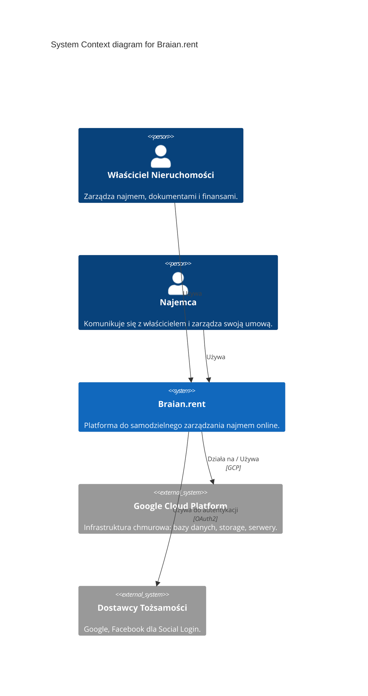
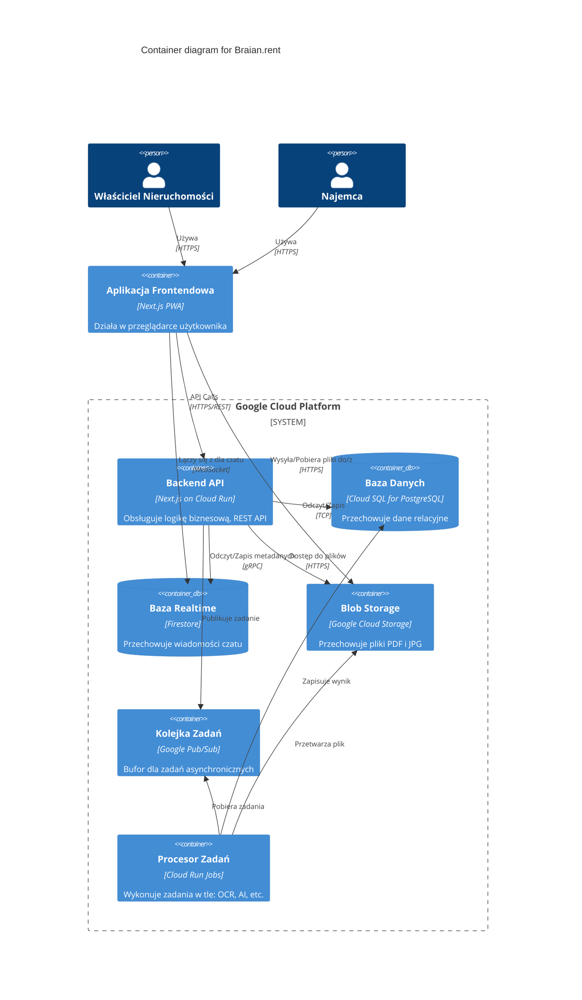

# Architektura Systemu i Decyzje Projektowe

# Wersja 1.2

Ten dokument opisuje wysokopoziomową architekturę systemu Braian.rent oraz rejestruje kluczowe decyzje architektoniczne (ADR), które ukształtowały projekt techniczny.

## 1\. Model Architektury (C4)

Poniższe diagramy w składni Mermaid zostaną automatycznie wyrenderowane do postaci graficznej przez GitHub.

### Poziom 1: Diagram Kontekstu (System Context)

Diagram ten przedstawia system Braian.rent jako "czarną skrzynkę" i ilustruje jego relacje z użytkownikami i systemami zewnętrznymi.

### Poziom 2: Diagram Kontenerów (Containers)

Ten diagram "przybliża" system Braian.rent, pokazując jego główne, współpracujące ze sobą komponenty techniczne ("kontenery").

## 2\. Rejestr Decyzji Architektonicznych (ADR)

Poniżej znajdują się kluczowe, trudne do odwrócenia decyzje, które podjęliśmy w trakcie projektowania systemu. Rejestrowanie ich pomaga zrozumieć, dlaczego system jest zbudowany w określony sposób.

### ADR-001: Wybór architektury serverless na Cloud Run

- **Status:** Zatwierdzona
- **Kontekst:** Potrzebujemy platformy backendowej, która jest skalowalna, tania w utrzymaniu i nie wymaga od nas zarządzania serwerami (VM).
- **Decyzja:** Cały backend opieramy o bezstanowe (stateless) kontenery uruchamiane na Google Cloud Run.
- **Konsekwencje:**
  - **Plusy:**
    - **Efektywność kosztowa:** Model 'pay-per-use' eliminuje koszty nieużywanych zasobów (skalowanie do zera).
    - **Niskie koszty operacyjne (Low-Ops):** Brak potrzeby zarządzania serwerami, systemami operacyjnymi i ich aktualizacjami.
    - **Szybkie wdrożenia:** Prosta integracja z CI/CD i błyskawiczne deploymenty.
  - **Minusy:**
    - **Wymóg bezstanowości:** Aplikacja musi być zaprojektowana od podstaw jako bezstanowa, co wpływa na obsługę sesji czy plików.

### ADR-002: Hybrydowe podejście do czatu (Firestore + Postgres)

- **Status:** Zatwierdzona
- **Kontekst:** Czat musi działać w czasie rzeczywistym i być prosty do implementacji na frontendzie. Jednocześnie, metadane wątków muszą być ściśle powiązane z resztą danych relacyjnych systemu.
- **Decyzja:** Treść wiadomości czatu jest przechowywana i synchronizowana przez Firestore. Metadane wątków (relacje Właściciel-Najemca-Nieruchomość) są przechowywane w PostgreSQL.
- **Konsekwencje:**
  - **Plusy:**
    - **Doskonałe UX:** Użytkownicy otrzymują wiadomości natychmiast, bez odświeżania strony.
    - **Prosty frontend:** Wykorzystanie gotowych bibliotek klienckich Firestore eliminuje potrzebę zarządzania połączeniami WebSocket.
    - **Integralność danych:** Kluczowe metadane pozostają w transakcyjnej bazie danych PostgreSQL.
  - **Minusy:**
    - **Rozproszenie danych:** Logika biznesowa dotycząca czatu musi operować na dwóch źródłach danych, co zwiększa złożoność backendu.

### ADR-003: Asynchroniczne przetwarzanie zadań (Pub/Sub + Cloud Run Jobs)

- **Status:** Zatwierdzona
- **Kontekst:** API musi być szybkie i responsywne. Operacje takie jak przyszłe przetwarzanie OCR czy generowanie treści przez AI mogą trwać długo i nie powinny blokować interfejsu użytkownika.
- **Decyzja:** Każde długotrwałe zadanie jest obsługiwane asynchronicznie. API natychmiast zwraca odpowiedź `202 Accepted` i publikuje wiadomość z zadaniem w kolejce Pub/Sub. Osobny serwis (Cloud Run Job) przetwarza te zadania w tle.
- **Konsekwencje:**
  - **Plusy:**
    - **Wysoka responsywność API:** Użytkownik otrzymuje natychmiastową odpowiedź z API.
    - **Skalowalność i odporność:** Kolejka zadań działa jako bufor. Możemy skalować liczbę "pracowników" (Jobs) niezależnie od ruchu na API.
  - **Minusy:**
    - **Zwiększona złożoność:** Wprowadza elementy systemów rozproszonych, takie jak potrzeba zapewnienia idempotencji zadań, monitorowanie stanu kolejek i obsługa ewentualnych ponowień.
