# 🚀 Terraform Deployment Guide - Braian.rent

## Przegląd

Kompletny przewodnik po wdrożeniu aplikacji Braian.rent na Google Cloud Platform przy użyciu Terraform i GitHub Actions.

## 📋 Wymagania Wstępne

### 1. Konto GCP

```bash
# Zaloguj się do GCP
gcloud auth login

# Utwórz nowy projekt lub użyj istniejącego
gcloud projects create braian-rent-prod --name="Braian Rent Production"

# Ustaw jako aktywny projekt
gcloud config set project braian-rent-prod

# Połącz billing account (wymagane!)
gcloud billing accounts list
gcloud billing projects link braian-rent-prod --billing-account=BILLING_ACCOUNT_ID
```

### 2. Wymagane Narzędzia

```bash
# Terraform
brew install terraform  # macOS
# or: https://www.terraform.io/downloads

# Google Cloud SDK
brew install --cask google-cloud-sdk  # macOS
# or: https://cloud.google.com/sdk/docs/install

# Weryfikacja
terraform version  # Should be >= 1.5.0
gcloud version
```

### 3. Service Account dla Terraform

```bash
# Utwórz service account
gcloud iam service-accounts create terraform-sa \
  --display-name="Terraform Service Account"

# Grant necessary roles
gcloud projects add-iam-policy-binding braian-rent-prod \
  --member="serviceAccount:terraform-sa@braian-rent-prod.iam.gserviceaccount.com" \
  --role="roles/editor"

gcloud projects add-iam-policy-binding braian-rent-prod \
  --member="serviceAccount:terraform-sa@braian-rent-prod.iam.gserviceaccount.com" \
  --role="roles/iam.securityAdmin"

# Create and download key
gcloud iam service-accounts keys create terraform-sa-key.json \
  --iam-account=terraform-sa@braian-rent-prod.iam.gserviceaccount.com

# Set credentials
export GOOGLE_APPLICATION_CREDENTIALS="$(pwd)/terraform-sa-key.json"
```

---

## 🏗️ Część 1: Terraform Deployment

### Krok 1: Przygotowanie Konfiguracji

```bash
cd terraform/

# Skopiuj przykładową konfigurację
cp terraform.tfvars.example terraform.tfvars

# Edytuj terraform.tfvars
nano terraform.tfvars
```

**Przykładowa konfiguracja `terraform.tfvars`:**

```hcl
# Development
project_id               = "braian-rent-dev"
region                   = "europe-west1"
environment              = "dev"
db_instance_tier         = "db-f1-micro"
cloud_run_min_instances  = 0
cloud_run_max_instances  = 5
cloud_run_cpu            = "1"
cloud_run_memory         = "512Mi"

# Production
# project_id               = "braian-rent-prod"
# region                   = "europe-west1"
# environment              = "prod"
# db_instance_tier         = "db-custom-2-4096"
# cloud_run_min_instances  = 1
# cloud_run_max_instances  = 100
# cloud_run_cpu            = "2"
# cloud_run_memory         = "1Gi"
```

### Krok 2: Inicjalizacja Terraform

```bash
# Inicjalizacja (pobiera providers)
terraform init

# Formatowanie kodu
terraform fmt

# Walidacja konfiguracji
terraform validate
```

### Krok 3: Planowanie Zmian

```bash
# Zobacz co zostanie utworzone
terraform plan

# Zapisz plan do pliku
terraform plan -out=tfplan
```

**Oczekiwany output:**

```
Plan: 25 to add, 0 to change, 0 to destroy.
```

### Krok 4: Zastosowanie Zmian

```bash
# Zastosuj zmiany (wymaga potwierdzenia)
terraform apply

# Lub użyj zapisanego planu
terraform apply tfplan
```

**Czas wykonania:** ~10-15 minut (Cloud SQL jest wolny)

### Krok 5: Weryfikacja

```bash
# Zobacz utworzone zasoby
terraform show

# Zobacz outputs
terraform output

# Szczegółowe informacje
terraform output -json | jq '.'
```

**Przykładowe outputs:**

```json
{
  "cloud_run_url": "https://braian-rent-service-xxx-ew.a.run.app",
  "cloud_sql_connection_name": "braian-rent-prod:europe-west1:braian-rent-db-prod",
  "artifact_registry_repository": "europe-west1-docker.pkg.dev/braian-rent-prod/braian-rent-images"
}
```

---

## 🔧 Część 2: GitHub Actions Setup

### Krok 1: Workload Identity Federation (Recommended)

**Dlaczego?** Bezpieczniejsze niż service account keys.

```bash
# 1. Enable IAM Credentials API
gcloud services enable iamcredentials.googleapis.com

# 2. Create Workload Identity Pool
gcloud iam workload-identity-pools create "github-pool" \
  --location="global" \
  --display-name="GitHub Actions Pool"

# 3. Create Workload Identity Provider
gcloud iam workload-identity-pools providers create-oidc "github-provider" \
  --location="global" \
  --workload-identity-pool="github-pool" \
  --display-name="GitHub Provider" \
  --attribute-mapping="google.subject=assertion.sub,attribute.actor=assertion.actor,attribute.repository=assertion.repository" \
  --issuer-uri="https://token.actions.githubusercontent.com"

# 4. Create Service Account for GitHub Actions
gcloud iam service-accounts create github-actions \
  --display-name="GitHub Actions Service Account"

# 5. Grant roles to service account
gcloud projects add-iam-policy-binding braian-rent-prod \
  --member="serviceAccount:github-actions@braian-rent-prod.iam.gserviceaccount.com" \
  --role="roles/run.admin"

gcloud projects add-iam-policy-binding braian-rent-prod \
  --member="serviceAccount:github-actions@braian-rent-prod.iam.gserviceaccount.com" \
  --role="roles/artifactregistry.writer"

gcloud projects add-iam-policy-binding braian-rent-prod \
  --member="serviceAccount:github-actions@braian-rent-prod.iam.gserviceaccount.com" \
  --role="roles/secretmanager.secretAccessor"

gcloud projects add-iam-policy-binding braian-rent-prod \
  --member="serviceAccount:github-actions@braian-rent-prod.iam.gserviceaccount.com" \
  --role="roles/cloudsql.client"

# 6. Allow GitHub to impersonate service account
gcloud iam service-accounts add-iam-policy-binding \
  github-actions@braian-rent-prod.iam.gserviceaccount.com \
  --role="roles/iam.workloadIdentityUser" \
  --member="principalSet://iam.googleapis.com/projects/PROJECT_NUMBER/locations/global/workloadIdentityPools/github-pool/attribute.repository/YOUR_GITHUB_USERNAME/braian.rent"

# Get your PROJECT_NUMBER
gcloud projects describe braian-rent-prod --format="value(projectNumber)"
```

### Krok 2: GitHub Secrets

Dodaj w GitHub Repository → Settings → Secrets and variables → Actions:

```bash
# Required secrets:
GCP_PROJECT_ID = "braian-rent-prod"
GCP_WORKLOAD_IDENTITY_PROVIDER = "projects/PROJECT_NUMBER/locations/global/workloadIdentityPools/github-pool/providers/github-provider"
GCP_SERVICE_ACCOUNT = "github-actions@braian-rent-prod.iam.gserviceaccount.com"
TF_STATE_BUCKET = "your-terraform-state-bucket"  # If using remote state
```

### Krok 3: Test Workflow

```bash
# Push to main branch to trigger deployment
git add .
git commit -m "feat: add terraform and CI/CD"
git push origin main

# Or trigger manually in GitHub Actions UI
```

---

## 🗄️ Część 3: Database Setup

### Po Terraform Apply

1. **Połącz się z Cloud SQL:**

   ```bash
   # Get connection name from Terraform output
   CONNECTION_NAME=$(terraform output -raw cloud_sql_connection_name)

   # Connect via Cloud SQL Proxy
   cloud_sql_proxy -instances=$CONNECTION_NAME=tcp:5432 &

   # Or connect directly (if you enabled public IP)
   gcloud sql connect braian-rent-db-prod --user=braian_app
   ```

2. **Uruchom migracje:**

   ```bash
   # Get DATABASE_URL from Secret Manager
   export DATABASE_URL=$(gcloud secrets versions access latest --secret=braian-rent-database-url)

   # Run migrations
   npx prisma migrate deploy

   # Generate Prisma Client
   npx prisma generate
   ```

3. **Seed database (optional):**
   ```bash
   npx prisma db seed
   ```

---

## 🔄 Część 4: CI/CD Pipeline

### Workflow Overview

```mermaid
graph LR
    A[Push to main] --> B[Lint & Test]
    B --> C[Build Docker Image]
    C --> D[Push to Artifact Registry]
    D --> E[Terraform Plan]
    E --> F[Terraform Apply]
    F --> G[Deploy to Cloud Run]
    G --> H[Run DB Migrations]
    H --> I[Health Check]
    I --> J[Verify Deployment]
```



### Jobs Breakdown

1. **lint-and-test**
   - ESLint
   - Prettier check
   - TypeScript compilation
   - Tests (when implemented)

2. **build-and-push**
   - Build Docker image
   - Tag with SHA and branch
   - Push to Artifact Registry
   - Cache for faster builds

3. **terraform**
   - Terraform plan
   - Terraform apply (on main)
   - Save outputs

4. **deploy**
   - Update Cloud Run service
   - Wait for deployment
   - Health check verification

5. **migrate-database**
   - Connect to Cloud SQL via proxy
   - Run `prisma migrate deploy`
   - Generate Prisma Client

6. **verify-deployment**
   - Test health endpoint
   - Test login page
   - Deployment summary

### Typical Duration

- **Total:** ~8-12 minutes
- Lint & Test: 1-2 min
- Build & Push: 3-5 min
- Terraform: 2-3 min (if no changes)
- Deploy: 1-2 min
- Migrations: 30s - 1 min

---

## 🔐 Security Best Practices

### 1. Service Account Permissions

✅ **Principle of Least Privilege:**

```bash
# Cloud Run only needs:
- roles/run.invoker (for itself)
- roles/cloudsql.client (for database)
- roles/secretmanager.secretAccessor (for secrets)
- roles/artifactregistry.reader (for images)
```

### 2. Secret Rotation

```bash
# Rotate NextAuth secret every 90 days
NEW_SECRET=$(openssl rand -base64 32)
echo -n "$NEW_SECRET" | gcloud secrets versions add braian-rent-nextauth-secret --data-file=-

# Restart Cloud Run to use new secret
gcloud run services update braian-rent-service --region europe-west1
```

### 3. Database Backups

```bash
# List backups
gcloud sql backups list --instance=braian-rent-db-prod

# Create on-demand backup
gcloud sql backups create --instance=braian-rent-db-prod

# Restore from backup
gcloud sql backups restore BACKUP_ID --backup-instance=braian-rent-db-prod
```

### 4. Audit Logs

```bash
# View who made changes
gcloud logging read "resource.type=cloud_run_revision" --limit 50

# View database operations
gcloud logging read "resource.type=cloudsql_database" --limit 50
```

---

## 📊 Monitoring & Alerts

### Set Up Alerts

```bash
# Alert on high error rate
gcloud alpha monitoring policies create \
  --notification-channels=CHANNEL_ID \
  --display-name="High Error Rate" \
  --condition-display-name="Error rate > 5%" \
  --condition-threshold-value=0.05 \
  --condition-threshold-duration=300s
```

### Dashboards

1. **Cloud Run Dashboard:**
   - https://console.cloud.google.com/run
   - View: Requests, Latency, Errors, CPU, Memory

2. **Cloud SQL Dashboard:**
   - https://console.cloud.google.com/sql
   - View: Connections, CPU, Memory, Disk I/O

3. **Custom Dashboard:**
   ```bash
   # Create custom dashboard with health check metrics
   # Cloud Console → Monitoring → Dashboards → Create Dashboard
   ```

---

## 🆘 Troubleshooting Guide

### Deployment Failed

**Check GitHub Actions logs:**

1. GitHub → Actions → Latest workflow run
2. Expand failed job
3. Check error messages

**Common issues:**

| Error                        | Solution                     |
| ---------------------------- | ---------------------------- |
| "Permission denied"          | Check service account roles  |
| "Image not found"            | Verify Artifact Registry URL |
| "Secret not found"           | Run terraform apply first    |
| "Database connection failed" | Check VPC connector          |
| "Timeout"                    | Increase `cloud_run_timeout` |

### Database Migration Failed

**Solution:**

```bash
# Manual migration
gcloud sql connect braian-rent-db-prod --user=braian_app

# Or via Cloud SQL Proxy
cloud_sql_proxy -instances=CONNECTION_NAME=tcp:5432 &
export DATABASE_URL="postgresql://..."
npx prisma migrate deploy
```

### Health Check Failed

**Check:**

```bash
# View service logs
gcloud run services logs read braian-rent-service --region europe-west1 --limit 100

# Test health endpoint
CLOUD_RUN_URL=$(gcloud run services describe braian-rent-service --region europe-west1 --format='value(status.url)')
curl "$CLOUD_RUN_URL/api/health"
```

### Terraform State Locked

**Solution:**

```bash
# Force unlock (use with caution!)
terraform force-unlock LOCK_ID

# Or wait for lock to expire (15 minutes)
```

---

## 🔄 Update & Rollback

### Deploy New Version

```bash
# Just push to main branch
git push origin main

# GitHub Actions will:
# 1. Build new image
# 2. Push to Artifact Registry
# 3. Update Cloud Run
# 4. Run migrations
```

### Rollback to Previous Version

```bash
# List revisions
gcloud run revisions list --service=braian-rent-service --region=europe-west1

# Rollback to specific revision
gcloud run services update-traffic braian-rent-service \
  --region=europe-west1 \
  --to-revisions=REVISION_NAME=100
```

### Canary Deployment

```bash
# Split traffic: 90% old, 10% new
gcloud run services update-traffic braian-rent-service \
  --region=europe-west1 \
  --to-revisions=OLD_REVISION=90,NEW_REVISION=10

# Monitor metrics, then shift 100% to new
gcloud run services update-traffic braian-rent-service \
  --region=europe-west1 \
  --to-latest
```

---

## 💰 Cost Optimization

### Development Environment

```hcl
# terraform.tfvars
environment              = "dev"
db_instance_tier         = "db-f1-micro"          # ~$10/month
cloud_run_min_instances  = 0                      # Scale to zero
cloud_run_max_instances  = 3
cloud_run_cpu            = "1"
cloud_run_memory         = "512Mi"
```

**Estimated cost:** ~$15-30/month

### Production Environment

```hcl
# terraform.tfvars
environment              = "prod"
db_instance_tier         = "db-custom-2-4096"     # ~$100/month
cloud_run_min_instances  = 1                      # Always warm
cloud_run_max_instances  = 100
cloud_run_cpu            = "2"
cloud_run_memory         = "1Gi"
```

**Estimated cost:** ~$150-400/month (depending on traffic)

### Cost Monitoring

```bash
# View current costs
gcloud billing accounts list
gcloud billing projects describe braian-rent-prod

# Set budget alerts
gcloud billing budgets create \
  --billing-account=BILLING_ACCOUNT_ID \
  --display-name="Monthly Budget" \
  --budget-amount=500USD \
  --threshold-rule=percent=50 \
  --threshold-rule=percent=90 \
  --threshold-rule=percent=100
```

---

## 📝 Environment Variables

### Provided by Terraform (Secret Manager)

| Secret            | Auto-generated? | Purpose               |
| ----------------- | --------------- | --------------------- |
| `DATABASE_URL`    | ✅ Yes          | PostgreSQL connection |
| `NEXTAUTH_SECRET` | ✅ Yes          | NextAuth encryption   |
| `JWT_SECRET`      | ✅ Yes          | JWT signing           |
| `SESSION_SECRET`  | ✅ Yes          | Session encryption    |
| `SENTRY_DSN`      | ❌ Manual       | Error tracking        |

### Add Sentry DSN Manually

```bash
# After creating Sentry project
echo -n "YOUR_SENTRY_DSN" | gcloud secrets versions add braian-rent-sentry-dsn --data-file=-

# Update Cloud Run to use it
gcloud run services update braian-rent-service \
  --region europe-west1 \
  --set-secrets=SENTRY_DSN=braian-rent-sentry-dsn:latest
```

---

## 🎯 Deployment Checklist

### Pre-deployment

- [ ] GCP project created and billing enabled
- [ ] Service account created with proper roles
- [ ] Terraform installed and configured
- [ ] `terraform.tfvars` created and filled
- [ ] GitHub repository created
- [ ] Workload Identity Federation configured
- [ ] GitHub secrets added

### Infrastructure

- [ ] `terraform init` successful
- [ ] `terraform plan` reviewed
- [ ] `terraform apply` completed
- [ ] All outputs visible
- [ ] Cloud SQL instance running
- [ ] Artifact Registry created
- [ ] Secrets in Secret Manager

### Application

- [ ] Docker image built locally
- [ ] Image pushed to Artifact Registry
- [ ] Cloud Run service deployed
- [ ] Database migrations completed
- [ ] Health check passing
- [ ] Login page accessible
- [ ] Can create account and login

### Post-deployment

- [ ] Custom domain configured (optional)
- [ ] Monitoring alerts set up
- [ ] Backup schedule verified
- [ ] Cost alerts configured
- [ ] Documentation updated
- [ ] Team notified

---

## 🔗 Useful Commands

### Terraform

```bash
# Refresh state
terraform refresh

# Show specific resource
terraform state show google_cloud_run_v2_service.main

# Remove resource from state (without destroying)
terraform state rm google_cloud_run_v2_service.main

# Import existing resource
terraform import google_cloud_run_v2_service.main projects/PROJECT/locations/REGION/services/SERVICE
```

### GCP

```bash
# View Cloud Run services
gcloud run services list

# View Cloud SQL instances
gcloud sql instances list

# View secrets
gcloud secrets list

# View Artifact Registry repositories
gcloud artifacts repositories list

# View service account
gcloud iam service-accounts list
```

### Debugging

```bash
# Cloud Run logs (live)
gcloud run services logs tail braian-rent-service --region europe-west1

# Cloud SQL logs
gcloud sql operations list --instance braian-rent-db-prod

# Describe Cloud Run service
gcloud run services describe braian-rent-service --region europe-west1

# Test connectivity to Cloud SQL
gcloud sql connect braian-rent-db-prod --user=braian_app
```

---

## 📚 Resources

- [Terraform Google Provider](https://registry.terraform.io/providers/hashicorp/google/latest/docs)
- [Cloud Run Documentation](https://cloud.google.com/run/docs)
- [Cloud SQL Best Practices](https://cloud.google.com/sql/docs/postgres/best-practices)
- [Workload Identity Federation](https://cloud.google.com/iam/docs/workload-identity-federation)
- [GitHub Actions for GCP](https://github.com/google-github-actions)

---

## ✅ Success Criteria

Your deployment is successful when:

1. ✅ Terraform apply completes without errors
2. ✅ Cloud Run service shows "healthy" status
3. ✅ Health check returns `{"status": "healthy"}`
4. ✅ Login page loads successfully
5. ✅ Can create account and login
6. ✅ Dashboard displays user data
7. ✅ No errors in logs
8. ✅ Database migrations applied

**Congratulations! Your application is live! 🎉**
